# Git commits

A ` commit ` in a git repository records a snapshot of all the files in your directory. It's like a giant copy and paste, but even better!

Git wants to keep commits as lightweight as possible though, so it doesn't just blindly copy the entire directory every time you commit. It can (when possible) compress a commit as a set of changes, or a "delta", from one version of the repository to the next.

Git also maintains a history of which commits were made when. That's why most commits have ancestor commits above them -- we designate this with arrows in our visualization. Maintaining history is great for everyone working on the project!

It's a lot to take in, but for now you can think of commits as snapshots of the project. Commits are very lightweight and switching between them is wicked fast!
```
git commit
git commit
```
| 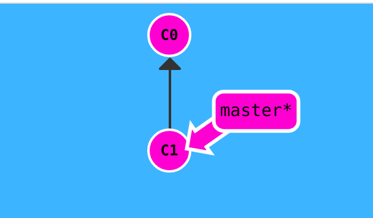| |
| :---: | :---: |
| **BEFORE** | **AFTER** |

# Git Branches

Branches in Git are incredibly lightweight as well. They are simply pointers to a specific commit -- nothing more. This is why many Git enthusiasts chant the mantra:

`branch early, and branch often`
Because there is no storage / memory overhead with making many branches, it's easier to logically divide up your work than have big beefy branches.

When we start mixing branches and commits, we will see how these two features combine. For now though, just remember that a branch essentially says "I want to include the work of this commit and all parent commits."

----------------------------------
Ok! You are all ready to get branching. Once this window closes, make a new branch named 'bugFix' and switch to that branch.

By the way, here's a shortcut: if you want to create a new branch AND check it out at the same time, you can simply type `git checkout -b [yourbranchname]`.
```
git branch bugFix
git checkout bugFix
```
| 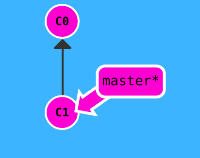|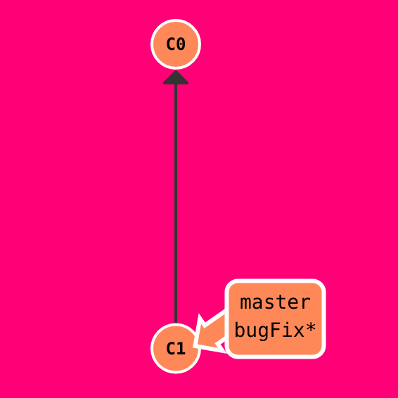 |
| :---: | :---: |
| **BEFORE** | **AFTER** |
# Brancches & Merging

Branches and Merging
Great! We now know how to commit and branch. Now we need to learn some kind of way of combining the work from two different branches together. This will allow us to branch off, develop a new feature, and then combine it back in.

The first method to combine work that we will examine is git merge. Merging in Git creates a special commit that has two unique parents. A commit with two parents essentially means "I want to include all the work from this parent over here and this one over here, and the set of all their parents."

- Make a new branch called `bugFix`
- Checkout the 'bugFix' branch with `git checkout bugFix`
- Commit once
- Go back to `master` with `git checkout`
- Commit another time
- Merge the branch `bugFix` into `master` with `git merge`
```
git checkout -b bugFix
git commit
git checkout master
git commit
git merge bugFix

```
| 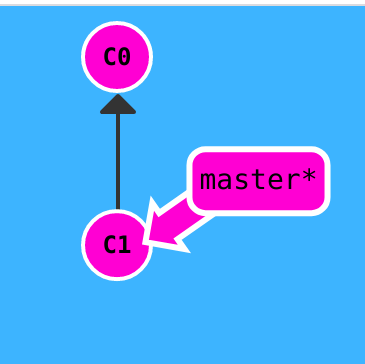|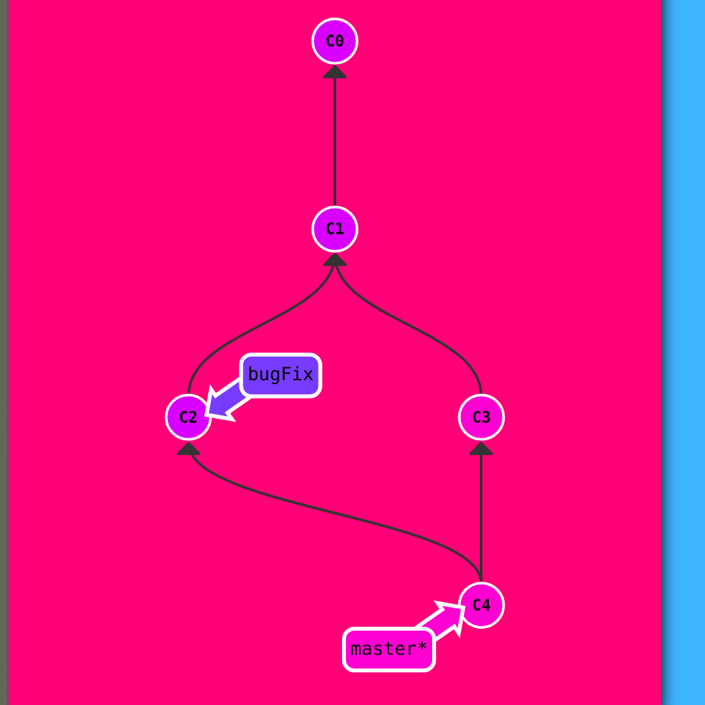 |
| :---: | :---: |
| **BEFORE** | **AFTER** |

# Rebase

The second way of combining work between branches is rebasing. Rebasing essentially takes a set of commits, "copies" them, and plops them down somewhere else.

While this sounds confusing, the advantage of rebasing is that it can be used to make a nice linear sequence of commits. The commit log / history of the repository will be a lot cleaner if only rebasing is allowed.

```
git checkout -b bugFix
git commit
git checkout master
git commit
git checkout bugFix
git rebase master

```
| 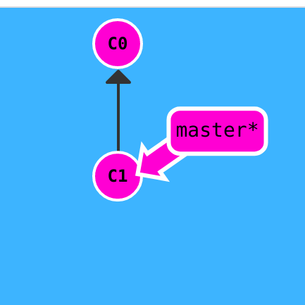|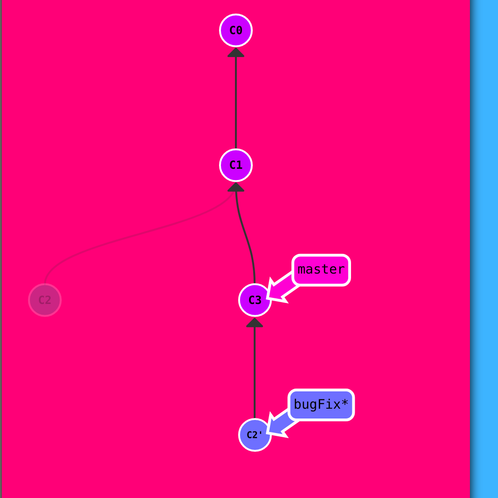 |
| :---: | :---: |
| **BEFORE** | **AFTER** |
# Brancches & Merging

# Head

First we have to talk about "HEAD". HEAD is the symbolic name for the currently checked out commit -- it's essentially what commit you're working on top of.

HEAD always points to the most recent commit which is reflected in the working tree. Most git commands which make changes to the working tree will start by changing HEAD.

Normally HEAD points to a branch name (like bugFix). When you commit, the status of bugFix is altered and this change is visible through HEAD.
```
git checkout C4

```
| 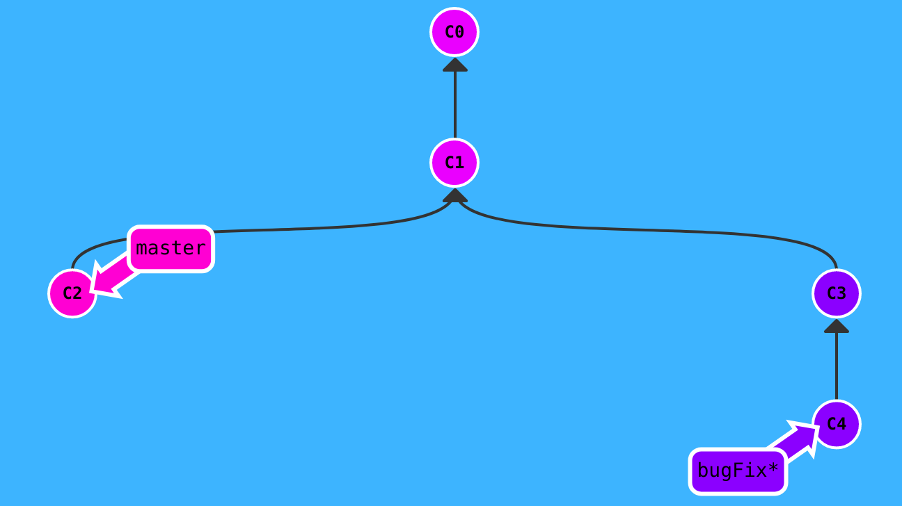|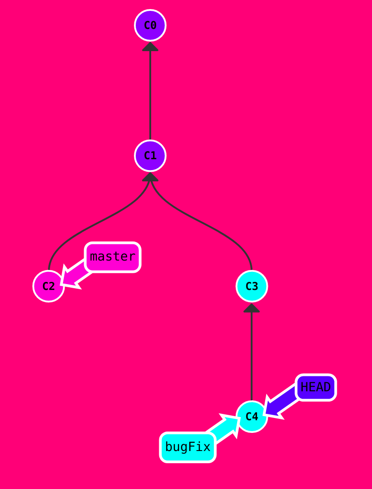 |
| :---: | :---: |
| **BEFORE** | **AFTER** |

# Relative Refs

Moving around in Git by specifying commit hashes can get a bit tedious. In the real world you won't have a nice commit tree visualization next to your terminal, so you'll have to use `git log` to see hashes.

Furthermore, hashes are usually a lot longer in the real Git world as well. For instance, the hash of the commit that introduced the previous level is `fed2da64c0efc5293610bdd892f82a58e8cbc5d8`. Doesn't exactly roll off the tongue...

The upside is that Git is smart about hashes. It only requires you to specify enough characters of the hash until it uniquely identifies the commit. So I can type `fed2` instead of the long string above.
## The "^" operator

Like I said, specifying commits by their hash isn't the most convenient thing ever, which is why Git has relative refs. They are awesome!

With relative refs, you can start somewhere memorable (like the branch `bugFix` or `HEAD`) and work from there.

Relative commits are powerful, but we will introduce two simple ones here:

Moving upwards one commit at a time with `^`
Moving upwards a number of times with `~<num>`

```
git checkout bugFix^
```
| 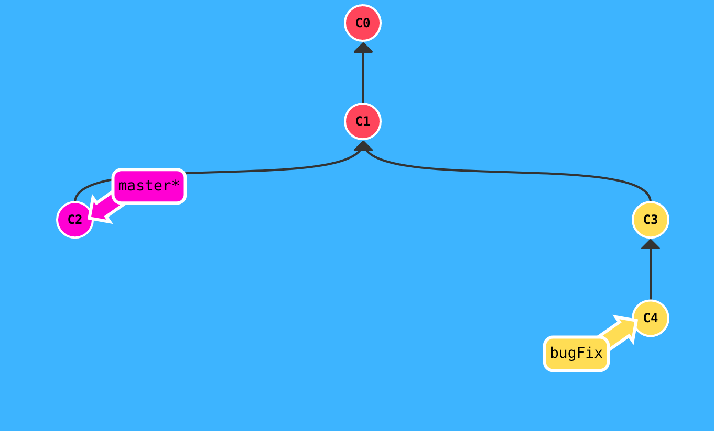|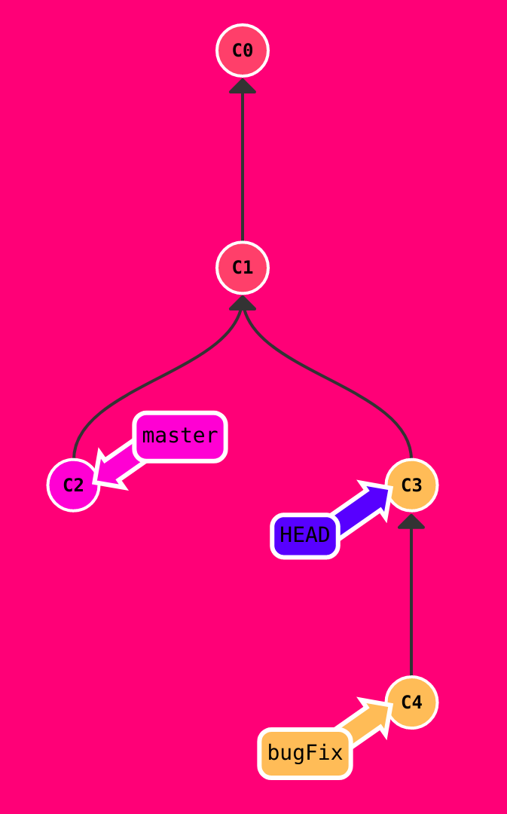 |
| :---: | :---: |
| **BEFORE** | **AFTER** |

## The "~" operator

Say you want to move a lot of levels up in the commit tree. It might be tedious to type ^ several times, so Git also has the tilde (~) operator.

The tilde operator (optionally) takes in a trailing number that specifies the number of parents you would like to ascend. Let's see it in action.


# Branch forcing
You're an expert on relative refs now, so let's actually use them for something.

One of the most common ways I use relative refs is to move branches around. You can directly reassign a branch to a commit with the `-f` option. So something like:

> git branch -f master HEAD~3

moves (by force) the master branch to three parents behind HEAD.

```
git branch -f master C6
git checkout HEAD~1
git branch -f bugFix HEAD~1
```
| 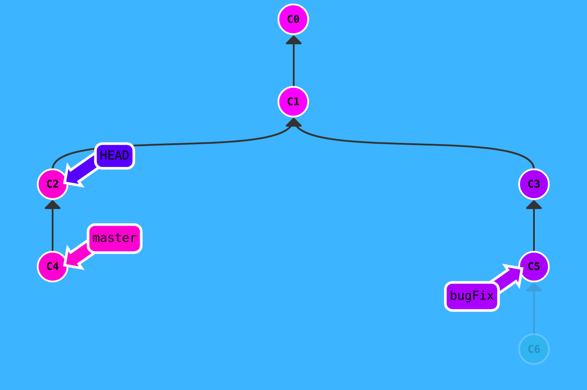|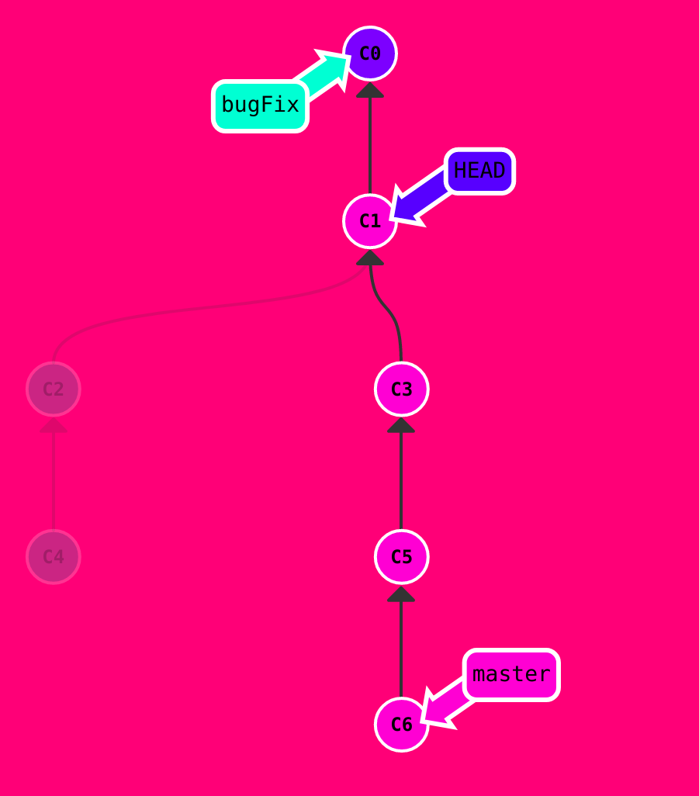 |
| :---: | :---: |
| **BEFORE** | **AFTER** |


# Reversing Changes in Git

There are many ways to reverse changes in Git. And just like committing, reversing changes in Git has both a low-level component (staging individual files or chunks) and a high-level component (how the changes are actually reversed). Our application will focus on the latter.

There are two primary ways to undo changes in Git -- one is using `git reset` and the other is using `git revert`.

`git reset` reverts changes by moving a branch reference backwards in time to an older commit. In this sense you can think of it as "rewriting history;" git reset will move a branch backwards as if the commit had never been made in the first place.
` git reset HEAD~1`

Imagine. Git moved the master branch reference back to C1; now our local repository is in a state as if C2 had never happened.

While resetting works great for local branches on your own machine, its method of "rewriting history" doesn't work for remote branches that others are using.

In order to reverse changes and share those reversed changes with others, we need to use `git revert`.

```
git reset HEAD~1
git checkout pushed
git revert HEAD
```
| 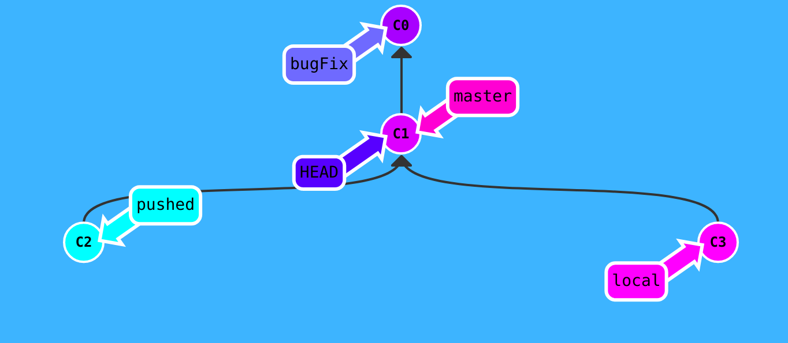| |
| :---: | :---: |
| **BEFORE** | **AFTER** |

# Moving Work Around
So far we've covered the basics of git -- committing, branching, and moving around in the source tree. Just these concepts are enough to leverage 90% of the power of git repositories and cover the main needs of developers.

That remaining 10%, however, can be quite useful during complex workflows (or when you've gotten yourself into a bind). The next concept we're going to cover is "moving work around" -- in other words, it's a way for developers to say "I want this work here and that work there" in precise, eloquent, flexible ways.

This may seem like a lot, but it's a simple concept.


## Git Cherry-pick
The first command in this series is called `git cherry-pick`. It takes on the following form:

`git cherry-pick <Commit1> <Commit2> <...>`
It's a very straightforward way of saying that you would like to copy a series of commits below your current location (HEAD). I personally love cherry-pick because there is very little magic involved and it's easy to understand.


```
git cherry-pick C3 C4 C7
```
| 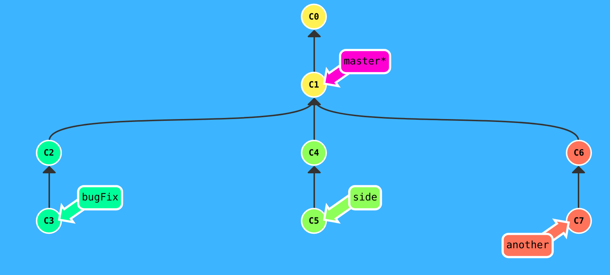|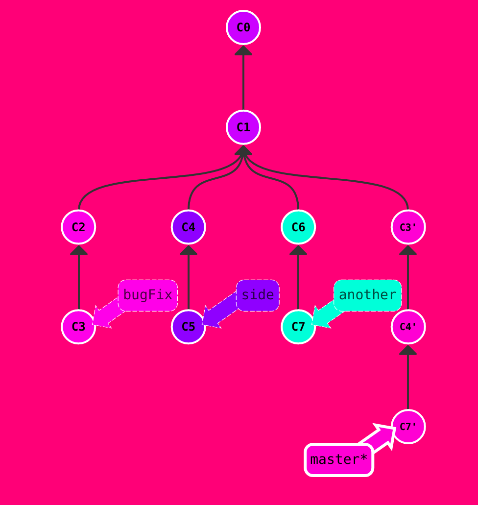 |
| :---: | :---: |
| **BEFORE** | **AFTER** |


## Git Interactive Rebase

Git cherry-pick is great when you know which commits you want (and you know their corresponding hashes) -- it's hard to beat the simplicity it provides.

But what about the situation where you don't know what commits you want? Thankfully git has you covered there as well! We can use interactive rebasing for this -- it's the best way to review a series of commits you're about to rebase.

All interactive rebase means is using the `rebase` command with the `-i` option.

If you include this option, git will open up a UI to show you which commits are about to be copied below the target of the rebase. It also shows their commit hashes and messages, which is great for getting a bearing on what's what.

For "real" git, the UI window means opening up a file in a text editor like `vim`.

When the interactive rebase dialog opens, you have the ability to do two things in our educational application:

> You can reorder commits simply by changing their order in the UI (in our window this means dragging and dropping with the mouse).
> You can choose to completely omit some commits. This is designated by `pick` -- toggling pick off means you want to drop the commit.

It is worth mentioning that in the real git interactive rebase you can do many more things like squashing (combining) commits, amending commit messages, and even editing the commits themselves. For our purposes though we will focus on these two operations above.It is worth mentioning that in the real git interactive rebase you can do many more things like squashing (combining) commits, amending commit messages, and even editing the commits themselves. For our purposes though we will focus on these two operations above.

`git rebase -i HEAD~4`


```
git rebase -i overHere (--solution-ordering C3,C5,C4)
```
| 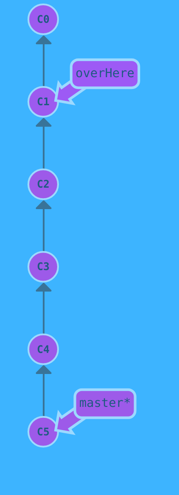|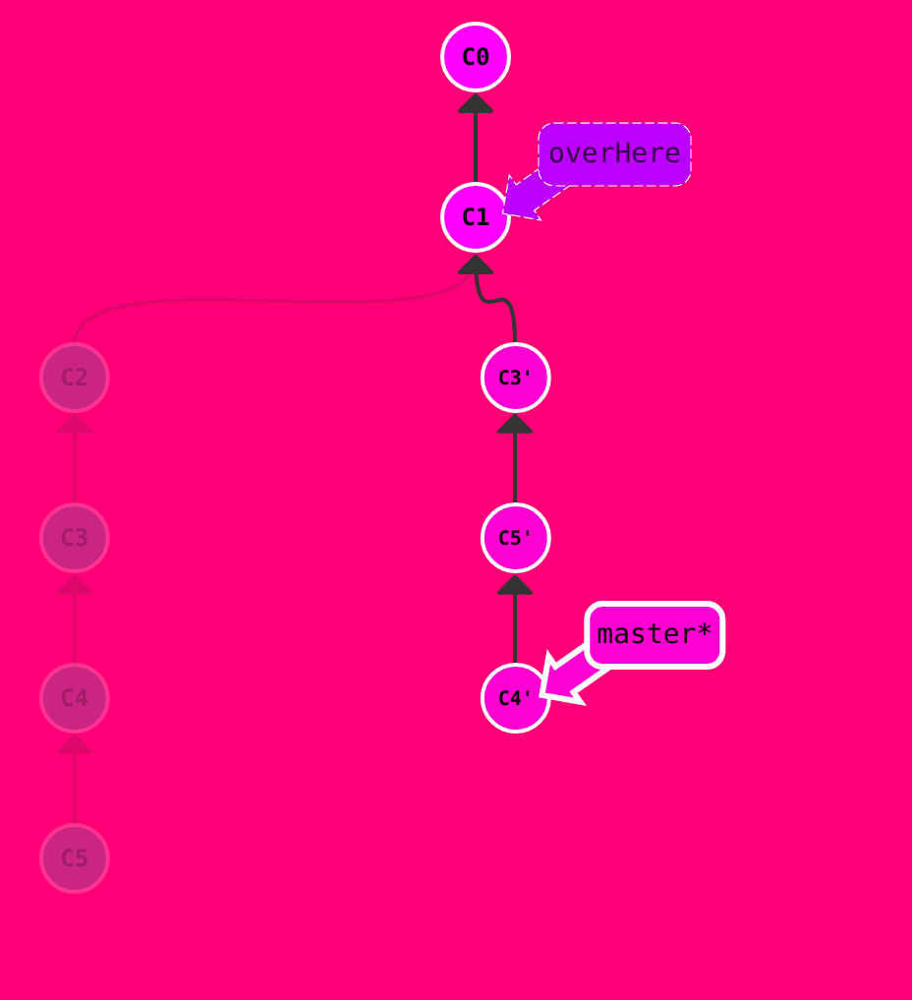 |
| :---: | :---: |
| **BEFORE** | **AFTER** |


# Locally stacked commits
Here's a development situation that often happens: I'm trying to track down a bug but it is quite elusive. In order to aid in my detective work, I put in a few debug commands and a few print statements.

All of these debugging / print statements are in their own commits. Finally I track down the bug, fix it, and rejoice!

Only problem is that I now need to get my bugFix back into the master branch. If I simply fast-forwarded master, then master would get all my debug statements which is undesirable. There has to be another way...
We need to tell git to copy only one of the commits over. This is just like the levels earlier on moving work around -- we can use the same commands:

`git rebase -i`
`git cherry-pick`

To achieve this goal.


```
git rebase -i master (--solution-ordering C4)
git rebase bugFix master
```
| 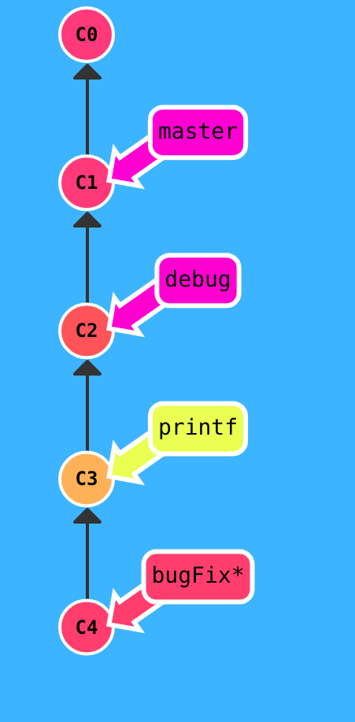|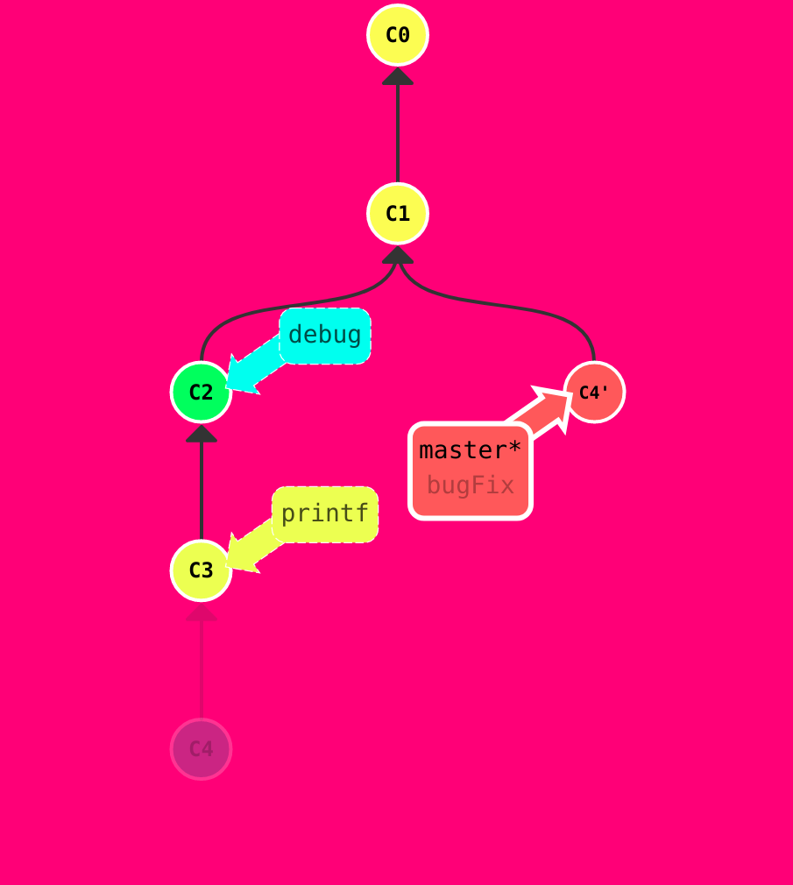 |
| :---: | :---: |
| **BEFORE** | **AFTER** |


# Juggling Commits
Here's another situation that happens quite commonly. You have some changes (newImage) and another set of changes (caption) that are related, so they are stacked on top of each other in your repository (aka one after another).

The tricky thing is that sometimes you need to make a small modification to an earlier commit. In this case, design wants us to change the dimensions of newImage slightly, even though that commit is way back in our history!!

We will overcome this difficulty by doing the following:

We will re-order the commits so the one we want to change is on top with `git rebase -i`
We will `git commit --amend` to make the slight modification
Then we will re-order the commits back to how they were previously with `git rebase -i`
Finally, we will move master to this updated part of the tree to finish the level (via the method of your choosing)

There are many ways to accomplish this overall goal (I see you eye-ing `cherry-pick`), and we will see more of them later, but for now let's focus on this technique. Lastly, pay attention to the goal state here -- since we move the commits twice, they both get an apostrophe appended. One more apostrophe is added for the commit we amend, which gives us the final form of the tree

That being said, I can compare levels now based on structure and relative apostrophe differences. As long as your tree's master branch has the same structure and relative apostrophe differences, I'll give full credit.

### First option

```
git rebase -i HEAD~2 (--solution-ordering C3,C2)
git commit --amend
git rebase -i HEAD~2 (--solution-ordering C2'',C3')
git rebase caption master
```
| 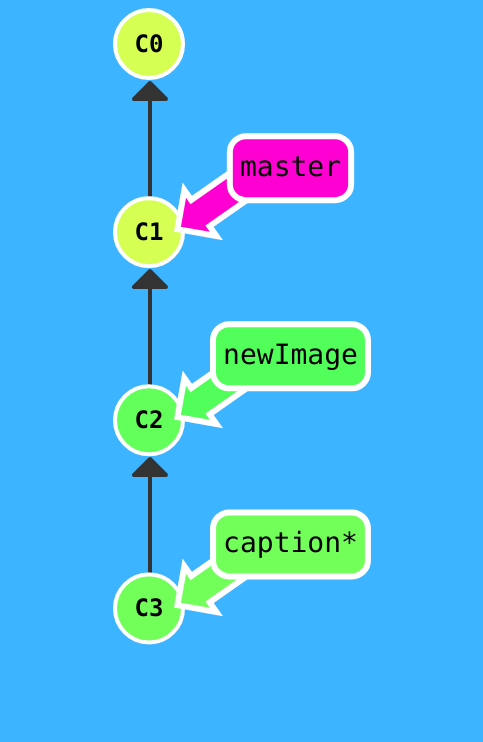| |
| :---: | :---: |
| **BEFORE** | **AFTER** |


### Second option

```
git checkout master
git cherry-pick C2
git commit --amend
git cherry-pick C3
```
| 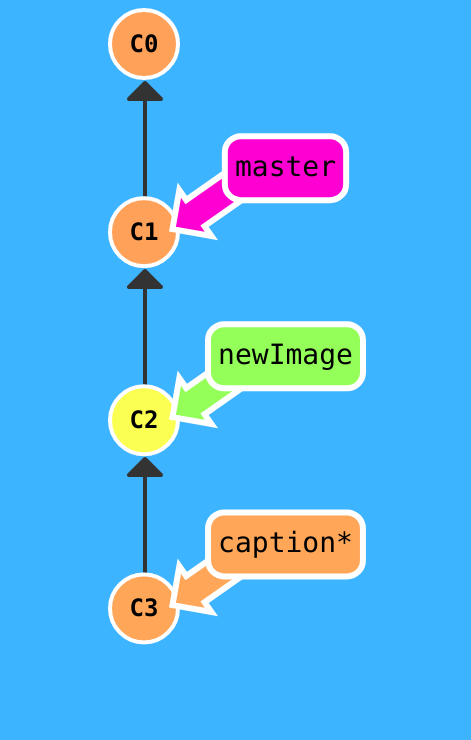|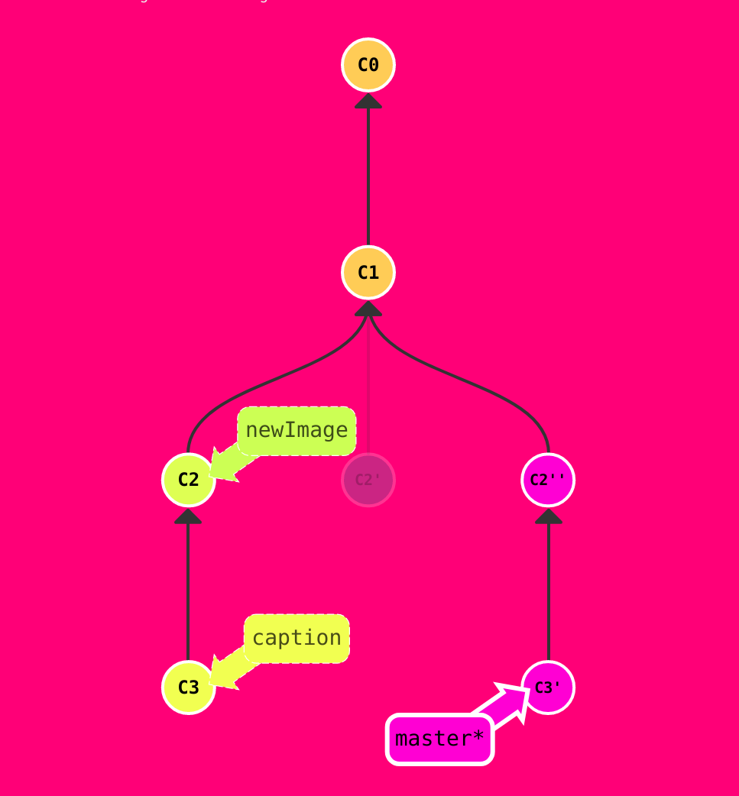 |
| :---: | :---: |
| **BEFORE** | **AFTER** |


# Git Tags

As you have learned from previous lessons, branches are easy to move around and often refer to different commits as work is completed on them. Branches are easily mutated, often temporary, and always changing.

If that's the case, you may be wondering if there's a way to permanently mark historical points in your project's history. For things like major releases and big merges, is there any way to mark these commits with something more permanent than a branch?

You bet there is! Git tags support this exact use case -- they (somewhat) permanently mark certain commits as "milestones" that you can then reference like a branch.

More importantly though, they never move as more commits are created. You can't "check out" a tag and then complete work on that tag -- tags exist as anchors in the commit tree that designate certain spots.

Let's see what tags look like in practice.

```
git tag v1 side~1;git tag v0 master~2;git checkout v1
```
| 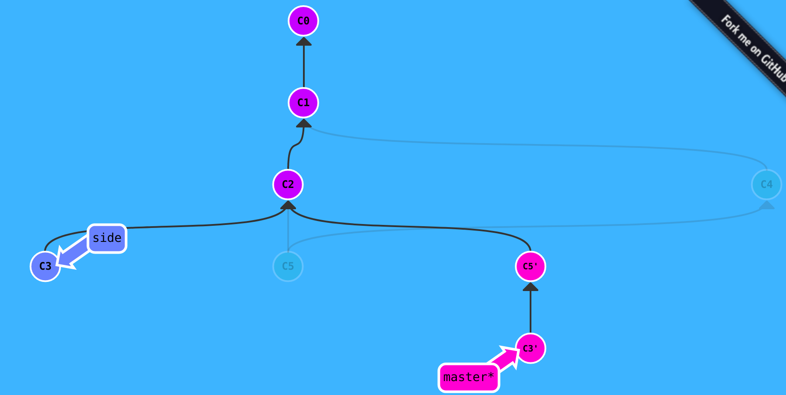|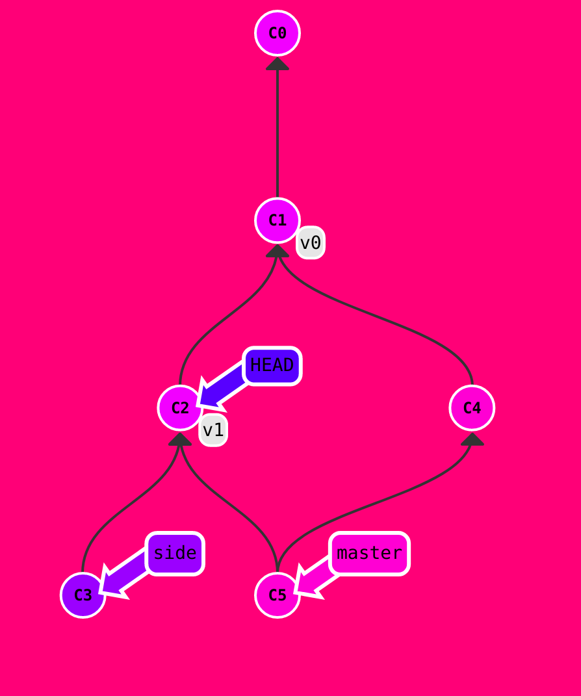 |
| :---: | :---: |
| **BEFORE** | **AFTER** |

# Git Describe

Because tags serve as such great "anchors" in the codebase, git has a command to describe where you are relative to the closest "anchor" (aka tag). And that command is called `git describe`!

Git describe can help you get your bearings after you've moved many commits backwards or forwards in history; this can happen after you've completed a git bisect (a debugging search) or when sitting down at a coworkers computer who just got back from vacation.

Git describe takes the form of:

`git describe <ref>`

Where `<ref>` is anything git can resolve into a commit. If you don't specify a ref, git just uses where you're checked out right now (`HEAD`).

The output of the command looks like:

`<tag>_<numCommits>_g<hash>`

Where `tag` is the closest ancestor tag in history,` numCommits `is how many commits away that tag is, and `<hash>` is the hash of the commit being described.


